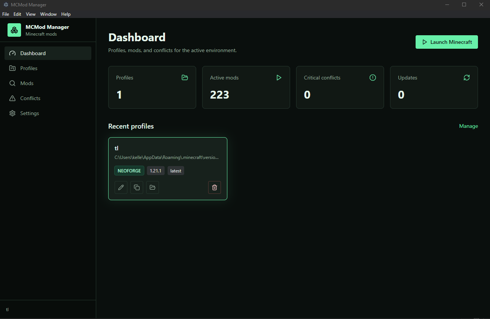
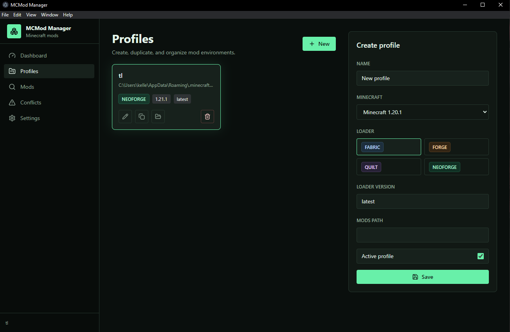
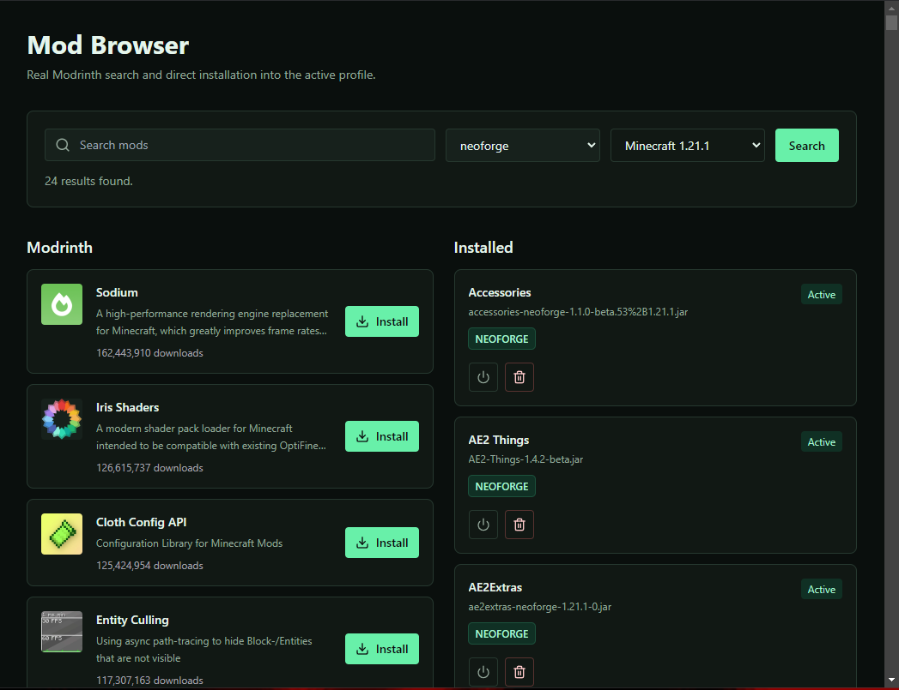
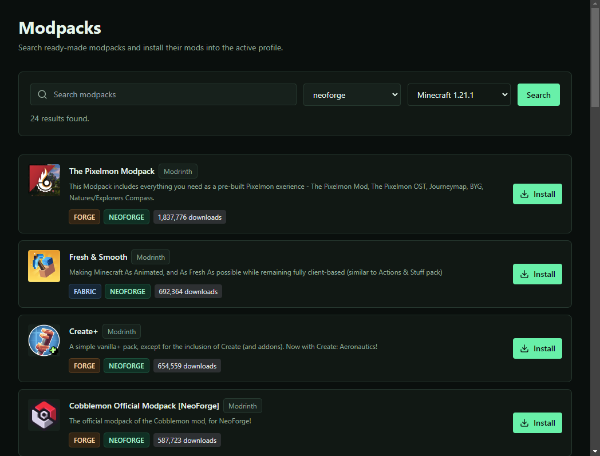
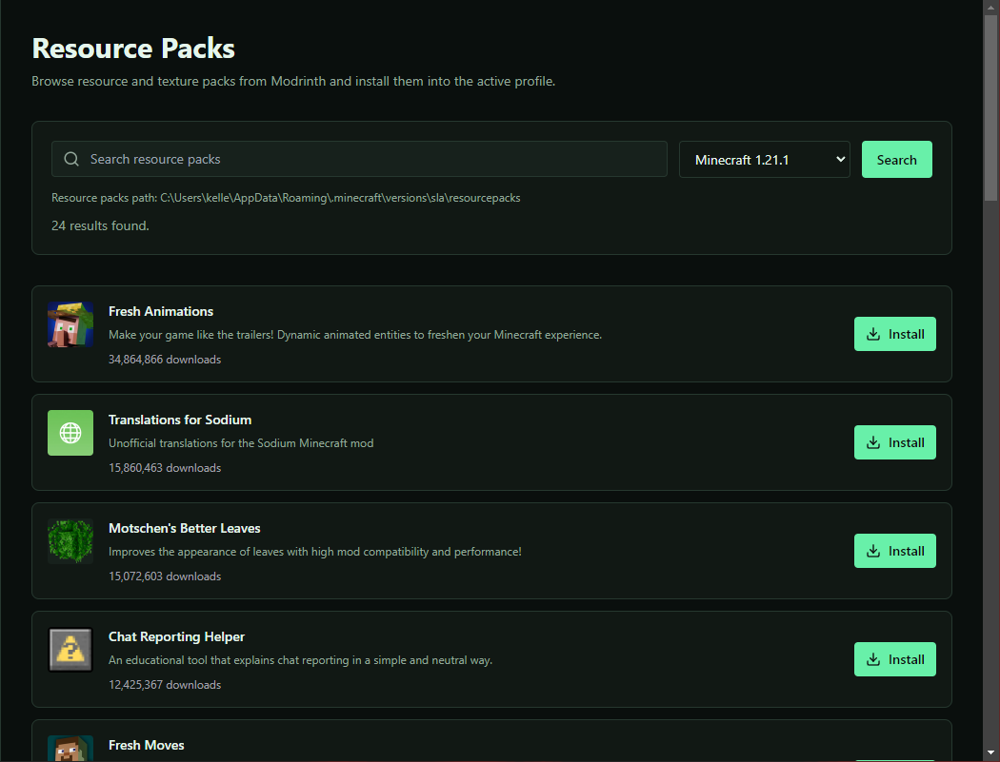
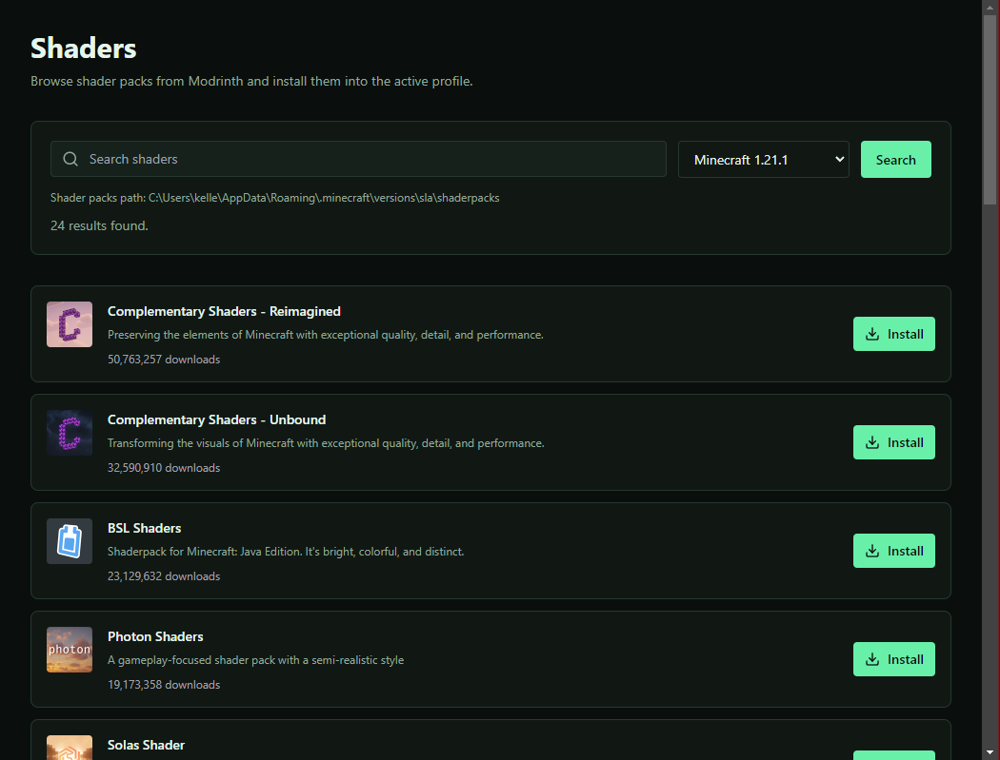
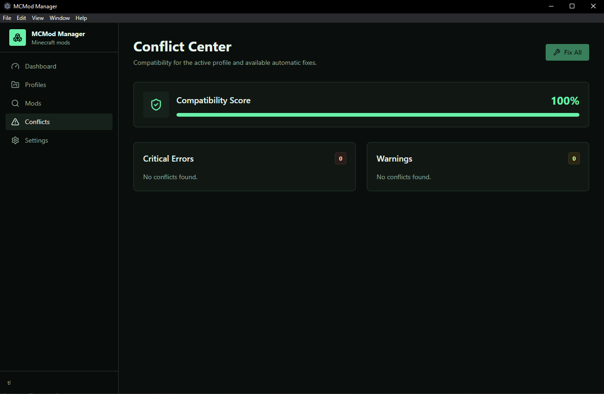
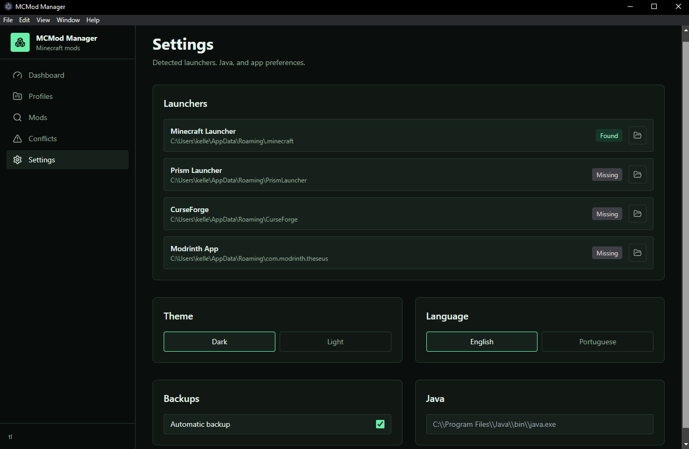

# MCMod Manager

Desktop app built with Electron, React 18, TypeScript, Tailwind CSS, and Zustand for managing Minecraft mods, modpacks, resource packs, shader packs, and local profiles.

## Download

Download the Windows executable here:

https://www.mediafire.com/file/13nnncaopd1d9co/MCMod-Manager-Setup-0.1.0.exe/file

## Screenshots

### Dashboard



### Profiles



### Mod Browser



### Modpacks



### Resource Packs



### Shaders



### Conflict Center



### Settings



## Requirements

- Node 18+
- npm

## Development

```bash
npm install
npm run dev
```

## Creating A Profile

Open **Profiles**, click **New**, choose the Minecraft version, loader, loader version, and confirm the `mods` folder path. The app tries to detect the default `.minecraft` folder for your operating system.

## Installing Mods

Open **Mods**, adjust the loader and Minecraft version for the active profile, then click **Install**. The app loads popular Modrinth projects by default and keeps loading more results as you scroll.

When a Modrinth mod declares required dependencies, MCMod Manager installs those dependencies automatically. For example, installing a mod that requires a core/library mod will download the required project too when a compatible file is available.

## Installing Modpacks

Open **Modpacks**, choose the loader and Minecraft version, then install a ready-made Modrinth modpack. The app downloads the `.mrpack`, reads its `modrinth.index.json`, and installs the referenced `.jar` files into the active profile's `mods` folder.

## Installing Resource Packs

Open **Resource Packs**, choose the Minecraft version, and click **Install** on a pack from Modrinth. Resource packs are installed into the `resourcepacks` folder next to the active profile's `mods` folder.

## Installing Shaders

Open **Shaders**, choose the Minecraft version, and click **Install** on a shader pack from Modrinth. Shader packs are installed into the `shaderpacks` folder next to the active profile's `mods` folder.

## Reading The Conflict Center

The **Conflict Center** separates critical errors from warnings. The Compatibility Score shows the percentage of installed mods without detected conflicts. Items with automatic fixes can be handled individually or through **Fix All**.

## Local Modpack Scanning

For local modpacks, MCMod Manager scans `.jar` files and reads Fabric, Quilt, Forge, and NeoForge metadata when available. It uses that metadata to detect loader mismatches, Minecraft version mismatches, missing required dependencies, declared incompatibilities, duplicate mods, and corrupted `.jar` files.

## Current Features

- Profile CRUD with launcher path detection
- Local `.jar` scanning from the selected mods folder
- Modrinth mod search with infinite scrolling
- Automatic installation of required Modrinth mod dependencies
- Modrinth modpack search and `.mrpack` installation
- Resource pack and shader pack search/install
- Conflict Center with critical errors, warnings, and compatibility score
- Dark/light theme toggle
- English and Portuguese language toggle
